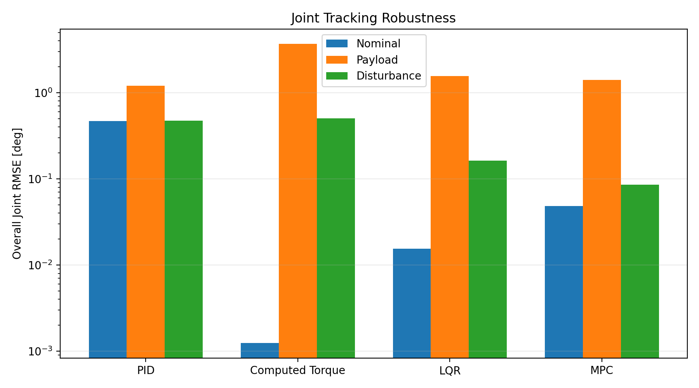
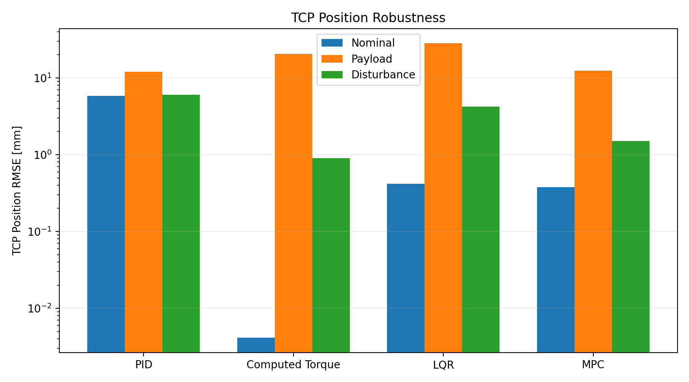
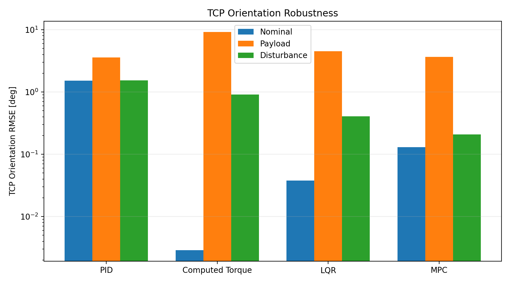
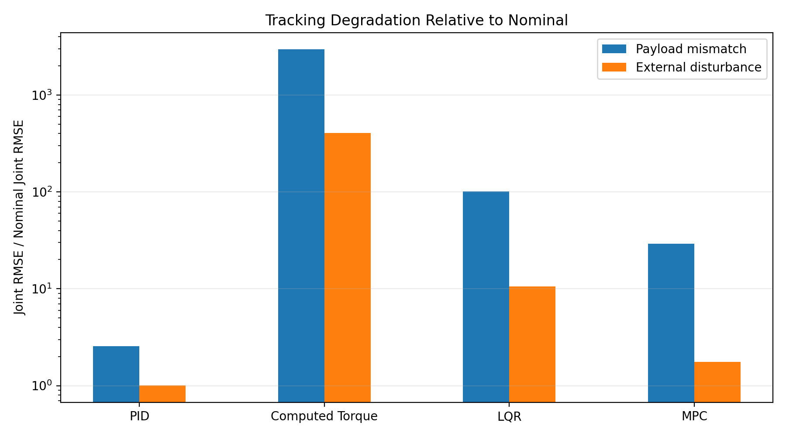
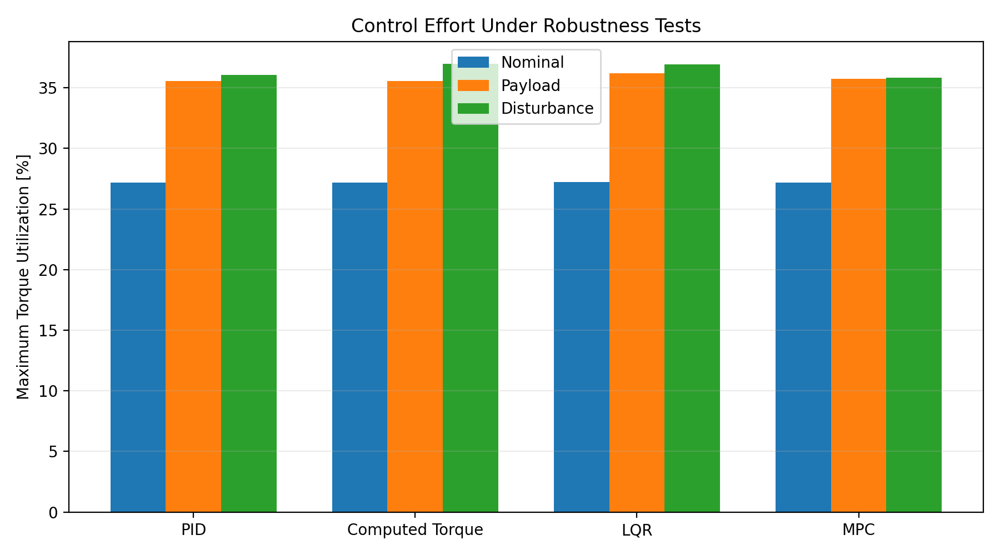

# UR5e Control Analysis

**Model validation, nonlinear dynamics characterization, controller design, cross-validation, and robustness assessment for the Universal Robots UR5e manipulator.**

This repository documents an engineering study built around a simple principle:

> **A controller should not be judged against a model that has not itself been validated.**

The work therefore begins by reconciling a Python rigid-body model with the official ROS 2 UR5e description and NVIDIA Isaac Sim, then progresses through nonlinear dynamics characterization and four controller architectures: **PID, Computed Torque, LQR, and MPC**.

The emphasis is not only on final tracking error. Failed assumptions, simulator inconsistencies, model sensitivity, computational cost, implementation structure, and robustness are treated as engineering results.

## Technical Reports

- [Part 1A — Kinematic & Dynamic Characterization](reports/UR5e_Part_1A_Kinematic_and_Dynamic_Characterization.pdf)
- [Part 1B — Controller Design & Robustness Assessment](reports/UR5e_Part_1B_Controller_Design_and_Robustness_Assessment.pdf)

---

## Project Roadmap

### Pre-Part 1 — Model Setup & Cross-Validation
**Status: Completed**

- Nominal UR5e parameter definition
- Standard-DH kinematic model
- URDF / physical-link frame reconciliation
- Link mass, center-of-mass, and inertia modeling
- Fixed-base Isaac Sim 6.1 configuration
- Link-pose, Jacobian, mass-matrix, and gravity cross-validation
- Simulator physics and joint-drive validation

### Part 1A — Kinematics & Dynamics Characterization
**Status: Completed**

- Forward/inverse kinematics and singularity characterization
- Pseudoinverse vs. damped-least-squares behavior
- Configuration-dependent mass matrix and gravity
- Coriolis/centrifugal modeling and structural consistency checks
- Nonlinear state-space plant
- Static equilibrium validation
- Numerical linearization at multiple configurations
- Controllability and local linear-model validity
- Common 4 s trajectory benchmark
- Inverse-dynamics torque benchmark
- Python ↔ C++ cross-validation

### Part 1B — Controller Design, Benchmarking & Robustness
**Status: Completed**

- Joint PID
- Computed-torque control
- Discrete LQR
- Constrained linear MPC
- Common nonlinear-plant benchmark
- TCP position/orientation metrics
- Control-effort and computation analysis
- Python ↔ C++ implementation checks
- Persistent payload/model mismatch test
- Transient external-disturbance test
- Cross-controller engineering assessment

### Part 2 — Independent Simulation Validation
**Status: Next**

The next stage transfers the controller study to the independently validated Isaac Sim environment. The objective is not additional tuning against the same analytical plant, but checking whether the conclusions remain consistent in a separate simulation implementation.

---

# 1. Engineering Approach

The analytical model and simulator can represent the same robot while differing in coordinate conventions, inertia frames, base constraints, gravity configuration, and actuator assumptions.

For that reason, simulation was treated as **another model requiring validation**, rather than as automatic ground truth.

```text
Manufacturer / ROS model data
            │
            ├──────────────► Python analytical model
            │
            └──────────────► Isaac Sim model
                              │
                              ▼
                    Simulation validation
                              │
                              ▼
                        Link poses
                              │
                              ▼
                         Jacobian
                              │
                              ▼
                           M(q)
                              │
                              ▼
                           g(q)
                              │
                              ▼
                   Validated common model
                              │
                              ▼
                 Dynamics characterization
                              │
                              ▼
             PID → CT → LQR → constrained MPC
                              │
                              ▼
                  Robustness assessment
```

This ordering mattered. During model validation, the first Python ↔ Isaac mass-matrix comparison showed an apparent discrepancy of approximately **64.7%**. Because the analytical kinematics and Jacobian had already passed independent checks, the analytical dynamics were not immediately modified to reproduce the simulator.

The investigation instead exposed simulator-side issues including floating-base interpretation, an inappropriate temporary base constraint, invalid gravity configuration, and zero-stiffness/zero-damping joint drives. Once corrected, the models converged closely.

> **Model validation requires simulation validation first.**

---

# 2. Reference Robot and Model

The project uses the nominal **Universal Robots UR5e** model.

## Standard DH Parameters

| Joint | a [m] | d [m] | alpha [rad] |
|---|---:|---:|---:|
| 1 | 0 | 0.1625 | +pi/2 |
| 2 | -0.4250 | 0 | 0 |
| 3 | -0.3922 | 0 | 0 |
| 4 | 0 | 0.1333 | +pi/2 |
| 5 | 0 | 0.0997 | -pi/2 |
| 6 | 0 | 0.0996 | 0 |

Moving-link masses:

```text
[3.761, 8.058, 2.846, 1.370, 1.300, 0.365] kg
```

The six modeled moving links total **17.7 kg**. This is not forced to equal the complete product-level arm mass because the accounting boundaries are different.

The implementation deliberately separates:

- **DH frames** for kinematic propagation, and
- **URDF-aligned physical-link frames** for CoM positions, inertia tensors, physical-link Jacobians, mass-matrix construction, and gravitational potential energy.

A DH frame is not assumed to be the physical inertia frame of a link.

---

# 3. Model Cross-Validation

The official ROS 2 UR5e description was imported into **NVIDIA Isaac Sim 6.1** and configured as a fixed-base 6-DOF articulation.

The principal nonzero validation configuration was

```text
q = [10, -40, 60, -30, 45, 20] deg
```

A nonzero pose was intentionally used because agreement at the zero configuration alone can hide sign, axis, and frame errors.

## Physical-Link Pose

Wrist-3 origin:

```text
Python:    [0.733548, 0.336215, 0.215589] m
Isaac Sim: [0.733552, 0.336198, 0.215773] m
```

Position difference:

```text
≈ 0.185 mm
```

## Jacobian

Representative J2 angular axis:

```text
Python:    [-0.173648, 0.984808, 0.000000]
Isaac Sim: [-0.173630, 0.984811, 0.000000]
```

## Mass Matrix

Selected diagonal terms at the validation pose:

| Element | Python | Isaac Sim |
|---|---:|---:|
| M11 | 3.103413 | 3.103188 |
| M22 | 3.342034 | 3.342024 |
| M33 | 0.833906 | 0.833856 |
| M44 | 0.021196 | 0.021143 |
| M66 | 0.000258 | 0.000258 |

The analytical mass matrix was symmetric and positive definite.

## Gravity

| Joint | Python [Nm] | Isaac Sim [Nm] | Absolute Difference [Nm] |
|---|---:|---:|---:|
| J1 | 0.000000 | 0.000008 | 0.000008 |
| J2 | -49.685494 | -49.681679 | 0.003815 |
| J3 | -18.034631 | -18.036629 | 0.001998 |
| J4 | -0.707495 | -0.707961 | 0.000466 |
| J5 | +0.068868 | +0.068971 | 0.000103 |
| J6 | 0.000000 | 0.000000 | 0.000000 |

The largest absolute gravity difference occurred at J2 and was approximately **0.0077%** of the Python value.

The dynamics convention throughout the project is

```text
M(q) q_ddot + C(q, q_dot) q_dot + g(q) = tau
```

---

# 4. Part 1A — Dynamics Characterization

After establishing a consistent model, the study moved from model construction to characterization.

The work included:

- singularity sweeps,
- pseudoinverse and DLS comparison,
- gravity and mass-matrix characterization,
- Coriolis/centrifugal dynamics,
- nonlinear state-space implementation,
- equilibrium analysis,
- numerical linearization,
- controllability,
- local linear-model validity,
- and a common trajectory benchmark.

The Coriolis implementation was checked using both dynamic consistency and the rigid-body skew-symmetry property. The nonlinear plant was implemented as

```text
x = [q, q_dot]

q_ddot = M(q)^(-1) [tau - C(q,q_dot)q_dot - g(q)]
```

Static equilibria satisfy

```text
q_dot = 0
tau = g(q)
```

Three linearization configurations produced full controllability rank:

```text
rank(C) = 12 / 12
```

The open-loop gravity-balanced rigid-body plant contains unstable local modes. This result describes the ideal analytical plant; it is not interpreted as the behavior of the proprietary UR5e internal servo system.

---

# 5. Common Controller Benchmark

All four controllers were evaluated against the same nonlinear bare-arm plant and the same trajectory.

## Initial and Goal Configurations

```text
q_start = [  0, -90,  90, -90, -90,  0] deg
q_goal  = [ 20, -60,  60, -70, -70, 20] deg
```

A 4 s quintic joint trajectory was sampled at

```text
Ts = 0.002 s
fs = 500 Hz
```

The modeled joint torque limits used throughout the benchmark were

```text
[150, 150, 150, 28, 28, 28] Nm
```

These are treated as model/import limits, not independently measured actuator torque ratings.

The reference inverse-dynamics trajectory required a maximum torque of approximately:

```text
[0.206, 40.792, 20.264, 1.825, 0.180, ~0] Nm
```

Thus the nominal trajectory itself remained well inside the modeled limits.

---

# 6. Controller Development

## 6.1 PID

A joint-space PID controller was tuned using effective joint inertias and a bandwidth/damping parameterization, followed by integral-gain sweeps.

Final design:

```text
wn      = 20 rad/s
zeta    = 3
alpha_i = 18
```

The final nominal overall joint RMSE was:

```text
0.469844 deg
```

A useful diagnostic result came from J4. Its largest tracking error was initially a candidate for saturation or coupling effects. Dynamic decomposition showed instead that the joint was primarily **gravity dominated**, while torque utilization remained low.

At the beginning of the trajectory the PID controller sees zero tracking error and therefore commands zero torque, whereas the plant already requires gravity compensation. The controller must first develop error before generating the required corrective torque.

That observation was more useful than simply increasing gains.

---

## 6.2 Computed Torque

The computed-torque controller uses

```text
v = qddot_ref + Kd(qdot_ref - qdot) + Kp(q_ref - q)

tau = M(q)v + C(q,qdot)qdot + g(q)
```

with

```text
Kp = 400 I
Kd = 40 I
```

Under the nominal plant, the controller achieved:

```text
Overall joint RMSE: 0.001244 deg
TCP position RMSE:  0.004139 mm
TCP orientation RMSE: 0.002883 deg
```

The commanded torque closely reproduced the Part 1A inverse-dynamics benchmark.

This near-perfect nominal result was intentionally not interpreted as proof of superior robustness. Because the controller directly cancels the modeled dynamics, its performance depends strongly on model fidelity—a point tested explicitly in the robustness study.

---

## 6.3 Discrete LQR

The first local LQR implementation used a fixed equilibrium feedforward torque and performed poorly on the nonlinear trajectory.

Rather than treating this only as a tuning failure, the controller structure was examined. The dominant issue was that a fixed gravity term did not follow the changing reference configuration.

Replacing the fixed term with reference-dependent gravity feedforward,

```text
tau = g(q_ref) - K [q - q_ref ; q_dot - qdot_ref]
```

reduced the nonlinear trajectory error substantially.

The final controller used:

- exact ZOH discretization,
- DARE solution,
- fixed linearization at the starting configuration,
- Bryson-style state/input normalization,
- `rho_u = 100`.

Nominal result:

```text
Overall joint RMSE: 0.015502 deg
TCP position RMSE:  0.418511 mm
TCP orientation RMSE: 0.037763 deg
```

The discrete closed-loop spectral radius was:

```text
0.9900498439
```

---

## 6.4 Constrained MPC

The MPC was formulated directly as a discrete quadratic program using the same linearized UR5e model.

Final design:

```text
Sampling period:      2 ms
Prediction horizon:   Np = 160  (320 ms)
Control horizon:      Nc = 40   (80 ms)
rho_u:                10
```

Joint torque constraints were included directly in the QP.

The initial implementation was computationally expensive because known reference-dependent terms were repeatedly reconstructed online. Profiling identified this as an implementation bottleneck rather than an unavoidable property of the controller.

The QP gradient was decomposed into:

```text
state-dependent term
+
known reference-dependent term
```

and the reference-dependent portion was precomputed offline for the planned trajectory.

The controller mathematics and tracking result were unchanged, but the online workload dropped substantially.

Final nominal result:

```text
Overall joint RMSE:     0.048474 deg
TCP position RMSE:      0.378424 mm
TCP orientation RMSE:   0.129772 deg
```

Final Python online MPC timing:

```text
Mean ≈ 1.03 ms
P99  ≈ 1.12 ms
```

The C++ implementation produced approximately:

```text
Mean ≈ 0.96 ms
```

with Python ↔ C++ torque agreement on the order of:

```text
2e-10 Nm
```

No hard real-time guarantee is claimed from desktop timing measurements.

---

# 7. Nominal Controller Comparison

| Controller | Overall Joint RMSE [deg] | TCP Position RMSE [mm] | TCP Orientation RMSE [deg] | Approx. Mean Computation |
|---|---:|---:|---:|---:|
| PID | 0.469844 | 5.835795 | 1.527910 | 0.026 ms |
| Computed Torque | 0.001244 | 0.004139 | 0.002883 | 8.25 ms* |
| LQR | 0.015502 | 0.418511 | 0.037763 | 0.52 ms |
| MPC | 0.048474 | 0.378424 | 0.129772 | 1.03 ms Python |

\*The computed-torque timing reflects the current Python dynamics implementation, including numerically expensive Coriolis evaluation. It should not be interpreted as an intrinsic timing limit of the control law.

The nominal benchmark shows why a single scalar ranking is not sufficient:

- PID is computationally inexpensive but carries larger gravity-related tracking error.
- Computed torque is exceptionally accurate when its model matches the plant.
- LQR gives low-cost optimal feedback around a fixed local model, but feedforward structure matters strongly on a moving nonlinear trajectory.
- MPC introduces prediction and explicit constraints, at a higher computational cost.

---

# 8. Robustness Assessment

Nominal performance does not answer how a controller behaves when the design model is wrong or an unmodeled force enters the plant.

Two controlled perturbations were therefore introduced **without retuning any controller**.

## R1 — Persistent Payload / Model Mismatch

Actual plant:

```text
Nominal UR5e + 2.0 kg point payload
Payload CoM = tool-frame +Z 0.10 m
```

Controller model:

```text
Nominal bare-arm UR5e
```

The payload altered both inertia and gravity. At the starting configuration, for example, J2 gravity changed from approximately:

```text
-20.264 Nm → -29.915 Nm
```

This test therefore represents a persistent plant/model mismatch rather than a temporary disturbance.

## R2 — Transient External Disturbance

An external generalized torque was applied to J2:

```text
+20 Nm
2.0 s <= t < 2.2 s
```

The controller was not given the disturbance.

This test separates transient disturbance rejection from persistent model mismatch.

---

# 9. Robustness Results

| Controller | Case | Joint RMSE [deg] | TCP Position RMSE [mm] | TCP Orientation RMSE [deg] | Max Torque Util. [%] |
|---|---|---:|---:|---:|---:|
| PID | Nominal | 0.469844 | 5.835795 | 1.527910 | 27.17 |
| PID | Payload | 1.205309 | 11.963438 | 3.585649 | 35.55 |
| PID | Disturbance | 0.472416 | 6.032206 | 1.531076 | 36.04 |
| Computed Torque | Nominal | 0.001244 | 0.004139 | 0.002883 | 27.19 |
| Computed Torque | Payload | 3.684475 | 20.562134 | 9.174375 | 35.54 |
| Computed Torque | Disturbance | 0.504513 | 0.900220 | 0.907051 | 36.98 |
| LQR | Nominal | 0.015502 | 0.418511 | 0.037763 | 27.22 |
| LQR | Payload | 1.564289 | 28.293832 | 4.533704 | 36.20 |
| LQR | Disturbance | 0.163066 | 4.246570 | 0.406142 | 36.95 |
| MPC | Nominal | 0.048474 | 0.378424 | 0.129772 | 27.17 |
| MPC | Payload | 1.412378 | 12.380191 | 3.659589 | 35.76 |
| MPC | Disturbance | 0.085670 | 1.503611 | 0.209132 | 35.82 |

## Joint Tracking Robustness



## TCP Position Robustness



## TCP Orientation Robustness



## Relative Degradation



## Torque Utilization



---

# 10. What the Robustness Tests Showed

The robustness tests produced a result that would have been hidden by nominal benchmarking alone.

### Computed Torque

Computed torque had the smallest nominal error by a large margin, but the 2 kg payload produced:

```text
0.001244 deg → 3.684475 deg overall joint RMSE
```

The very large degradation ratio is partly a consequence of the extremely small nominal denominator, so absolute error and ratio must be interpreted together.

The result nevertheless demonstrates the controller's dependence on model fidelity: exact nominal cancellation does not imply tolerance to persistent model mismatch.

### PID

PID began with the largest nominal tracking error, but its relative degradation under the payload was much smaller.

The integral action also allowed substantial recovery after persistent and transient error, although transient joint errors remained larger than in the nominal case.

This is a useful example of why robustness should not be inferred from nominal precision alone.

### LQR

The fixed-model LQR was affected by both payload mismatch and the transient J2 disturbance.

Its payload TCP position RMSE increased from:

```text
0.419 mm → 28.294 mm
```

The result is consistent with the controller being designed around a fixed nominal linearization while the actual nonlinear plant has changed.

### MPC

MPC was also affected by the persistent payload mismatch:

```text
TCP position RMSE:
0.378 mm → 12.380 mm
```

Under the specific J2 +20 Nm / 200 ms transient disturbance, however, the increase was smaller:

```text
Joint RMSE:
0.0485 deg → 0.0857 deg
```

This result is reported only for the tested condition; it is not generalized into a universal robustness ranking.

### Constraints

No torque saturation or MPC constraint activation occurred in the nominal, payload, or disturbance benchmarks.

Therefore these tests evaluate **tracking, model sensitivity, and disturbance rejection**. They do **not** constitute a demonstration of MPC's constraint-handling advantage.

A separate deliberately constraint-active test would be required for that purpose.

---

# 11. Python ↔ C++ Cross-Validation

Selected online control implementations were independently checked in C++.

### PID

The comparison exposed a one-sample anti-windup update-order discrepancy. After aligning the implementation order, the Python and C++ outputs matched.

### LQR

The online feedback, summation, and saturation implementation passed cross-validation with maximum torque differences on the order of numerical precision.

### MPC

The optimized MPC implementation was cross-validated at the commanded-torque level:

```text
Maximum Python ↔ C++ torque difference ≈ 2.03e-10 Nm
```

This step was important because performance optimization is useful only if it preserves the controller being evaluated.

---

# 12. Key Engineering Findings

This project produced several conclusions beyond the final benchmark numbers.

1. **Validate the simulator before using it to invalidate the analytical model.**  
   The initial 64.7% mass-matrix disagreement was traced primarily to simulation setup, not to a need to force the analytical model toward the first simulator output.

2. **Frame consistency matters as much as the equations.**  
   Separating DH kinematic frames from physical inertia frames was essential for dynamics agreement.

3. **A tracking symptom does not identify its cause.**  
   The PID J4 error initially looked like a possible gain, coupling, or saturation problem. Dynamic decomposition showed that gravity was the dominant term.

4. **Controller architecture matters beyond gain tuning.**  
   The initial LQR trajectory problem was largely resolved by changing the feedforward structure rather than repeatedly tuning the same fixed-gravity formulation.

5. **Profiling should precede optimization.**  
   MPC computation was reduced by identifying which calculations were reference-dependent and moving them offline, rather than changing the optimization problem merely to obtain a faster benchmark.

6. **Nominal accuracy and robustness are different properties.**  
   Computed torque provided extremely high nominal accuracy while showing strong sensitivity to persistent model mismatch.

7. **Relative degradation requires context.**  
   Ratios become extremely large when the nominal denominator is near zero. Absolute error, relative degradation, and physical significance should be reported together.

8. **Constraint capability should not be claimed when constraints never activate.**  
   The MPC includes explicit torque constraints, but the current benchmark does not demonstrate their active handling.

---

# 13. Model and Study Boundaries

The current study deliberately remains a nominal rigid-body control investigation.

- Nominal UR5e geometry is used; robot-specific factory calibration is not included.
- No gripper is included in the nominal model.
- The R1 payload is a controlled robustness perturbation, not a calibrated end-effector model.
- Links are rigid bodies.
- Gearbox compliance, backlash, detailed friction, and proprietary actuator/servo dynamics are not identified.
- Isaac joint gains used during model validation are not interpreted as identified physical UR servo gains.
- Contact dynamics are outside Part 1.
- Imported/simulator effort limits are model limits rather than independently measured motor torque ratings.
- Desktop Python/C++ timing is not a hard real-time certification.
- The robustness tests are controlled cases, not an exhaustive uncertainty analysis.

These boundaries are intentional. Part 2 uses the independently validated Isaac Sim model as the next level of validation rather than increasing complexity inside the same analytical plant.

---

# 14. Repository Structure

```text
ur5e_control_analysis/
├── analysis/              # Characterization, tuning, benchmarks, robustness
├── controllers/           # PID, computed torque, LQR, MPC
├── cpp/                   # C++ controller/cross-validation implementations
├── dynamics/              # Rigid-body, state-space, payload/disturbance plants
├── kinematics/            # FK, IK, Jacobian
├── models/                # UR5e parameters
├── notebooks/             # Exploratory notebooks
├── reports/               # Part 1A and Part 1B technical reports
├── results/
│   ├── computed_torque/
│   ├── data/
│   ├── figures/
│   ├── lqr/
│   ├── mpc/
│   ├── pid/
│   └── robustness/
├── tests/                 # Controller and Python/C++ validation tests
├── trajectories/          # Joint trajectory generation
└── visualization/
```

The repository retains intermediate sweeps and diagnostic analyses where they explain how a final design decision was reached. They are part of the engineering record rather than only a collection of final benchmark scripts.

---

# 15. Main Entry Points

### Model and dynamics

```text
models/ur5e_parameters.py
kinematics/forward_kinematics.py
kinematics/jacobian.py
dynamics/rigid_body_dynamics.py
dynamics/state_space.py
```

### Final controllers

```text
controllers/pid.py
controllers/computed_torque.py
controllers/lqr.py
controllers/mpc.py
```

### Nominal benchmarks

```text
analysis/pid_final_benchmark.py
analysis/computed_torque_benchmark.py
analysis/lqr_nominal_benchmark.py
analysis/mpc_nominal_benchmark.py
```

### Robustness

```text
dynamics/payload_dynamics.py
dynamics/disturbance_dynamics.py
analysis/*_payload_robustness.py
analysis/*_disturbance_robustness.py
analysis/robustness_comparison.py
```

---

# 16. Software Environment

- Ubuntu 22.04
- ROS 2 Humble
- Python 3.10
- NumPy / SciPy
- OSQP
- Jupyter
- C++
- NVIDIA Isaac Sim 6.1

---

# 17. References

Primary model and simulator references used in the study include:

- Universal Robots — DH parameters for kinematics and dynamics
- Universal Robots — ROS 2 robot description
- NVIDIA Isaac Sim 6.1 — articulation/manipulator documentation
- Universal Robots — UR5e technical specification

Detailed controller methodology, assumptions, equations, numerical results, and limitations are documented in the technical reports linked at the top of this README.

---

# Author

**Sooyong Kim**

Robotics & Autonomous Systems  
[sooyongtech.dev](https://sooyongtech.dev/)
